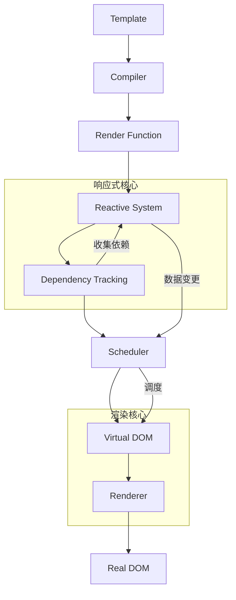

# Vue 3 核心原理模块架构

┌─────────────────────────────────────────────────────────────┐
│ Vue 3 核心架构 │
├─────────────────────────────────────────────────────────────┤
│ 编译时 (Compiler) │ 运行时 (Runtime) │
├─────────────────────────────────────────────────────────────┤
│ • 模板编译 │ • 响应式系统 │
│ • 静态提升 │ • 虚拟 DOM 系统 │
│ • Patch Flag 优化 │ • 组件系统 │
│ • Tree Shaking 支持 │ • 渲染器 │
└─────────────────────────────────────────────────────────────┘

## 核心模块详解:响应式系统 (Reactivity System)

这是 Vue 3 最核心的改进，基于 Proxy 实现

## 核心模块详解:依赖收集 (Dependency Tracking)

┌─────────────────────────────────────────────┐
│ 依赖收集流程图 │
├─────────────────────────────────────────────┤
│ 1. 组件渲染 │
│ 2. 读取响应式数据 │
│ 3. Proxy.get 拦截 → track() │
│ 4. 将当前 effect 加入 dep │
│ 5. 数据变更时触发 dep 中所有 effect │
└─────────────────────────────────────────────┘

## 模板编译 (Compiler)

// 模板编译流程
模板 → 解析(AST) → 转换(优化) → 代码生成

标记出静态内容，减轻运行时计算开销

## 虚拟 DOM 与渲染器 (Virtual DOM & Renderer)

虚拟 DOM 核心目标：解决直接操作真实 DOM 性能低下和开发体验差的问题。

渲染器是将虚拟 DOM 转换为真实 DOM 并挂载到页面的具体实现层。它是虚拟 DOM 概念的执行引擎。

## 完整原理图

┌─────────────────────────────────────────────────────────────┐
│ Vue 3 运行原理图 │
└─────────────────────────────────────────────────────────────┘

                        ┌─────────────┐
                        │   Template  │
                        │   (模板)    │
                        └──────┬──────┘
                               │ 编译
                               ▼
                        ┌─────────────┐
                        │  Render     │
                        │  Function   │
                        │ (渲染函数)  │
                        └──────┬──────┘
                               │ 执行
                               ▼

┌─────────────────┐ ┌─────────────┐ ┌─────────────────┐
│ Reactive │ │ Virtual │ │ Component │
│ Data │◄──►│ DOM │◄──►│ Instance │
│ (响应式数据) │ │ (虚拟 DOM) │ │ (组件实例) │
└────────┬────────┘ └──────┬──────┘ └─────────────────┘
│ │
│ 依赖收集/触发更新 │ Diff & Patch
▼ ▼
┌─────────────────┐ ┌─────────────┐
│ Effects │ │ Real DOM │
│ (副作用) │ │ (真实 DOM) │
└─────────────────┘ └─────────────┘

## 模块关系图

## pinia

Pinia 是 Vue 3 的官方状态管理库，其核心设计理念是简单性、类型安全和组合式 API 友好。

Pinia 的设计哲学体现了 Vue 3 的核心理念：

简单性：去除了 mutations，支持直接修改

类型安全：充分利用 TypeScript 的类型推断

组合式：与 Composition API 完美融合

模块化：扁平化的 store 结构

可扩展性：强大的插件系统

## vue-router

vue的插件
vue的全局组件注册

https://juejin.cn/post/6854573222231605256?searchId=2025122318023961E7CC8A03A0793EC611#heading-9
