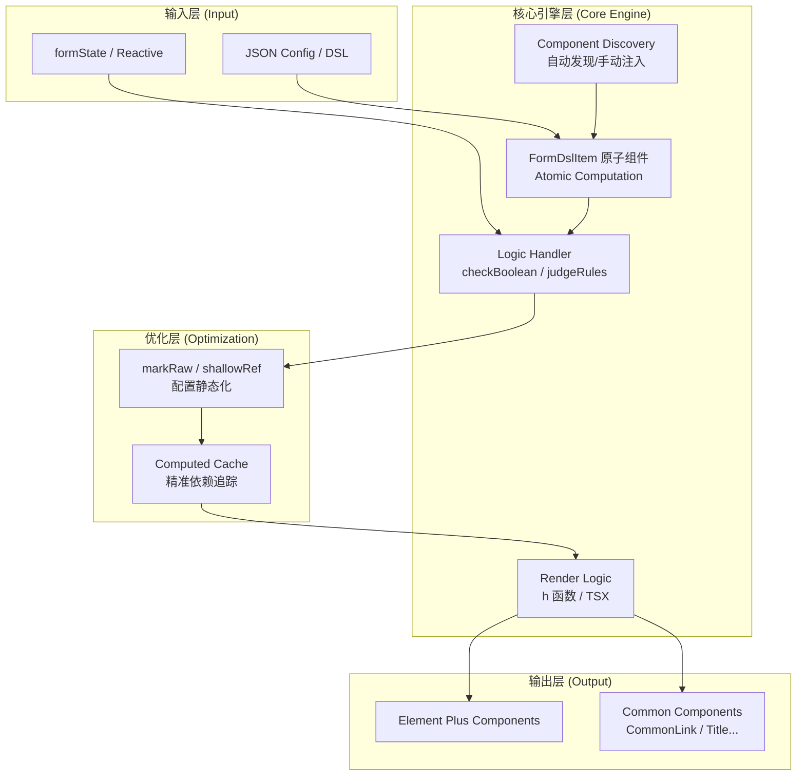

# **构建高性能 DSL 驱动的动态表单系统**

## **1. 功能概览 (Features)**
该系统通过一套 JSON 协议（DSL）实现了表单的完全配置化，支持极其复杂的业务场景：
- **声明式 UI 渲染**：支持 Element Plus 全量组件及自定义业务组件（如 `CommonLink`）。
- **动态联动逻辑**：通过配置 `show`、`disabled`、`placeholder` 等属性，实现基于表单状态的实时显隐、禁用及文案切换。
- **复杂嵌套布局**：支持 `div` 等容器组件，可无限嵌套实现多级分组布局。
- **跨字段联合校验**：通过 `linkValidateKey` 机制，实现字段间的协同校验（如“两次密码一致性”、“A+B 限制”）。
- **自动化组件发现**：支持特定目录下组件的自动扫描与按需注入，实现框架逻辑与业务组件的深度解耦。

## **2. 核心原理 (Principles)**
系统的核心逻辑遵循 **“数据驱动 + 动态组件 + 依赖追踪”** 的模式：

- **DSL 协议层**：定义一套标准化的 JSON 结构，描述字段属性、交互逻辑和校验规则。
- **发现引擎**：利用 Vite 的 `import.meta.glob` 或手动目录索引，将配置中的字符串 `is: 'CommonLink'` 映射为真实的 Vue 组件定义。
- **渲染引擎 (FormDslItem)**：
    - 使用 Vue 3 的 **JSX/TSX** 编写，通过 `h()` 函数动态创建 VNode。
    - **递归渲染**：处理嵌套结构，确保属性层层透传。
- **状态管理**：采用单向数据流，所有组件共享一个响应式的 `formState`。

## **3. 性能优化点 (Optimizations)**
这是本项目最核心的技术亮点，解决了传统配置化表单在大型场景下的卡顿问题：

### **A. 非响应式配置处理 (Structural Static)**
- **痛点**：巨大的配置 JSON 如果放入 `reactive`，Vue 会递归代理成千上万个属性，耗费大量内存和 CPU。
- **优化**：对 `formConfig` 使用 `markRaw` 或 `shallowRef`。**配置结构是静态的，数据引用是动态的**。Vue 不再追踪配置树的变动，仅追踪 `formState` 的变动。

### **B. 原子化计算缓存 (Atomic Computation)**
- **痛点**：全局 `computed` 渲染会导致“牵一发而动全身”，修改一个字符触发全量配置重算。
- **优化**：**逻辑计算下沉**。将 DSL 的解析逻辑（如 `checkBoolean`）从父级移动到每个 `FormDslItem` 内部。
- **原理**：利用 Vue 3 组件级别的 `computed` 实现自动 Memoization。修改 `A` 字段，只有依赖 `A` 的组件会触发重算，其他 99% 的组件直接从缓存读取结果，重算复杂度从 **O(N)** 降至 **O(1)**。

### **C. 依赖追踪与按需更新**
- 引擎不再主动扫描哪些字段需要更新，而是通过响应式系统的“被动触发”机制，实现了极其精准的按需渲染。

---

## **4. 系统架构设计图 (Design Diagram)**

---

## **5. 文章总结金句**
- *“配置化不应以牺牲性能为代价，通过计算下沉，我们让表单拥有了 O(1) 级别的交互响应力。”*
- *“将 Vue 的响应式系统作为天然的缓存池，是解决复杂 DSL 渲染瓶颈的最优解。”*
- *“结构与数据分离，让 UI 保持静态，让交互保持灵动。”*

这份总结涵盖了从业务到架构再到性能深水区的全貌，非常适合作为技术分享或博客的大纲。