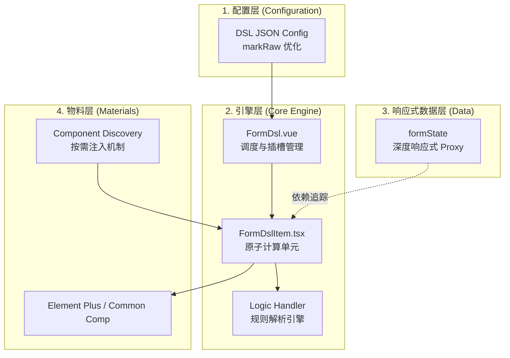
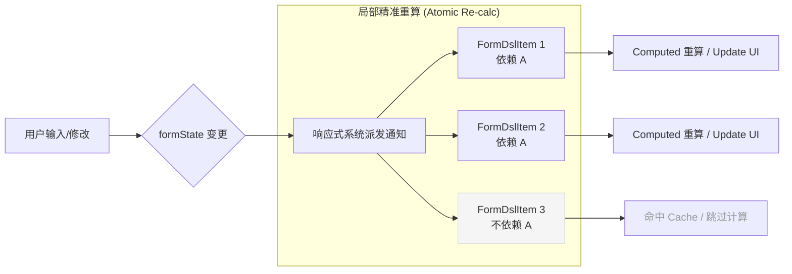

# 构建高性能 DSL 驱动的动态表单系统

在复杂的中后台业务场景中，表单往往承载着繁重的业务逻辑。为了提升开发效率并降低维护成本，我们设计并实现了一套基于 DSL（领域特定语言）的动态表单系统。本文将深度解析该系统的功能特性、底层架构及其在极致性能优化上的实践。

---

## 1. 核心功能特性

系统通过一套标准化的 JSON 协议描述表单，实现了“配置即 UI”的声明式开发模式：

- **声明式 UI 渲染**：无缝支持 Element Plus 全量组件，并支持通过 `customComponents` 注入业务自定义组件（如 `CommonLink`）。
- **动态联动引擎**：支持基于 `show`（显隐）、`disabled`（禁用）、`placeholder`（动态文案）的复杂逻辑判断。
- **递归嵌套布局**：支持 `div` 等容器组件无限嵌套，轻松实现多级分组、卡片式布局等复杂结构。
- **跨字段联合校验**：通过 `linkValidateKey` 机制实现字段间的协同校验（如“两次密码一致性”、“A+B 限制”）。
- **组件按需注入**：利用 Vite 的 `import.meta.glob` 自动扫描或手动导出机制，实现业务组件与框架引擎的深度解耦。

---

## 2. 极致性能优化实践

传统的配置化表单在处理大型配置（几百个字段）时常有卡顿，我们通过以下两项核心优化解决了这一痛点：

### A. 配置静态化 (Structural Static)
- **挑战**：Vue 的 `reactive` 会递归代理 JSON 树的所有属性，大型配置会导致巨大的内存和 CPU 开销。
- **优化**：对 `formConfig` 使用 `markRaw`。**锁定配置结构为静态，仅保持数据引用为动态**。Vue 不再追踪配置树本身的变动，极大减轻了 Proxy 的负担。

### B. 原子化计算缓存 (Atomic Computation)
- **挑战**：全局 `computed` 会在任何字段变动时触发全量配置重算（O(N) 复杂度）。
- **优化**：**逻辑计算下沉**。将解析逻辑从父级移动到每个 `FormDslItem` 内部。
- **原理**：利用 Vue 3 组件级的精准依赖追踪。当字段 A 变动时，仅依赖 A 的组件会触发重算，其余 99% 的组件命中缓存（O(1) 复杂度），实现了极其流畅的交互响应。

---

## 3. 架构设计图示

### 系统架构分层 (Layered Architecture)
展示了从 DSL 配置到最终 UI 渲染的垂直解耦关系。

### 运行时逻辑流转 (Runtime Flow)
展示了修改字段时，系统如何实现精准的局部更新。

---

## 4. 总结

该表单系统的核心哲学是：**将 Vue 的响应式系统作为天然的缓存池**。

通过将计算逻辑原子化并锁定静态配置，我们成功将配置化表单的性能瓶颈从“配置规模”转变为“交互规模”。这不仅让复杂的业务逻辑可以通过 JSON 纯净地表达，更确保了在超大规模表单下依然拥有 O(1) 级别的响应力。

---

## 5. 项目地址

- **GitHub**: [vue3-config-form-table](https://github.com/cala2cala/vue3-config-form-table)
- [预览地址](https://cala2cala.github.io/vue3-config-form-table/) 
