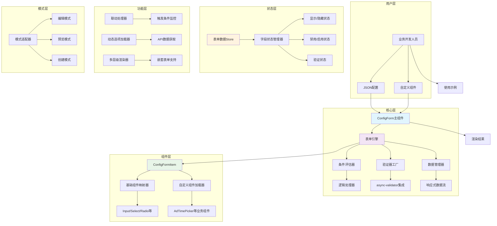

# 配置化表单设计

## 需求背景

在做广告投放的业务中，对不同的广告投放渠道进行广告投放，有不同的参数。根据业务需求，我们设计了配置化的表单，通过 JSON 将表单渲染出来，实现对不同渠道下表单的快速配置。

### 具体功能

1. 常用表单项支持，input、radio、select 等 UI 组件库的常见表单项都需要支持。
2. 封装业务定制组件。如广告投放时间的选择，精确到半小时，封装成业务通用的表单项组件。
3. 支持预览、编辑、创建态。
4. 操作逻辑符号支持 eq|between|in|gt|lt|gte|lte，"logic": "and|or"。
5. 支持传入自定义的表单项组件。
6. 支持联动展示逻辑。
7. 支持多层级表单项展示。

用户编写的 json 如下：

```JSON
{
  "formConfig": { // 表单全局配置
    "mode": "edit",
    "logic": "and",
    "customComponents": ["AdTimePicker"]
  },
  "formItems": [
    {
      "type": "input",
      "label": "广告名称",
      "model": "name",
      "required": true,
      "visibleIn": ["edit", "create"],
      "disabledLogic": {
        "when": {
          "field": "adType",
          "operator": "neq",
          "value": "template"
        }
      }
    },
    {
      "type": "radio",
      "label": "广告类型",
      "model": "adType",
      "options": [
        { "label": "普通", "value": "normal" },
        { "label": "模板", "value": "template" }
      ],
      "visibleIn": ["edit", "create"],
      "triggerLogic": [
        {
          "when": {
            "field": "adType",
            "operator": "eq",
            "value": "template"
          },
          "then": {
            "templateSelector": { "show": true },
            "name": { "disabled": true }
          }
        }
      ]
    },
    {
      "type": "custom",
      "component": "AdTimePicker",
      "label": "投放时间",
      "model": "schedule",
      "props": {
        "precision": "half-hour"
      },
      "visibleIn": ["edit", "create"],
      "validationLogic": {
        "operator": "gt",
        "compareWith": "startTime",
        "message": "必须晚于开始时间"
      }
    },
    {
      "type": "select",
      "label": "目标平台",
      "model": "platform",
      "options": [],
      "visibleIn": ["edit", "create"],
      "dynamicOptions": {
        "dependsOn": ["region"],
        "api": "/api/platforms?region={{region}}"
      }
    },
    {
      "type": "number",
      "label": "预算(元)",
      "model": "budget",
      "visibleIn": ["edit", "create"],
      "validationLogic": {
        "rules": [
          {
            "operator": "gte",
            "value": 100,
            "message": "预算不能低于100元"
          },
          {
            "operator": "lte",
            "value": 100000,
            "message": "预算不能超过10万元"
          }
        ]
      },
      "displayLogic": {
        "when": {
          "field": "adType",
          "operator": "eq",
          "value": "normal"
        }
      }
    },
    {
      "type": "date",
      "label": "开始时间",
      "model": "startTime",
      "visibleIn": ["edit", "create"],
      "validationLogic": {
        "operator": "lt",
        "compareWith": "endTime",
        "message": "必须早于结束时间"
      }
    }
  ]
}
```

## 实现设计

用户使用时传染如下

```javascript
<ConfigForm config={formConfig} v-model={formData.value}></ConfigForm>
```

在 ConfigForm 里将用户传入的 formConfig，转换成 UI 组件库里所需要的数据格式。

1. 对 displayLogic、disabledLogic 转换成 computed 类型的值，监测相关的变量变化
2. 对包含 operator 的 validationLogic，封装成 async-validator 支持

ConfigForm 组件和 ConfigFormItem 组件通过 provide 和 inject 共享表单数据。

### 设计要点说明

1. 响应式设计：所有逻辑都基于响应式计算，自动处理字段间的依赖关系

2. 组件解耦：主组件只负责协调，具体渲染逻辑在表单项组件中

3. 扩展性：通过自定义组件注册机制支持业务组件

4. 性能优化：使用 computed 缓存计算结果，避免不必要的重渲染

5. 类型安全：完整的 TypeScript 类型定义

### 系统架构图


